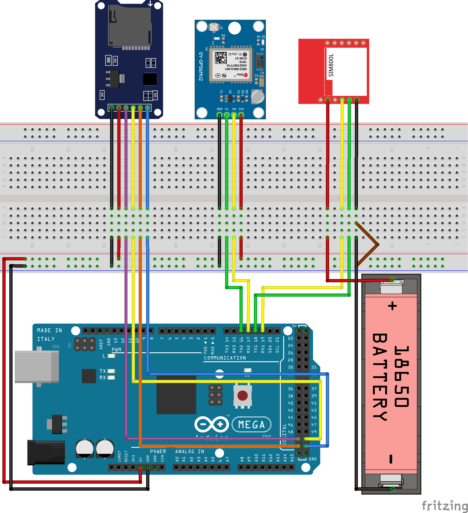

# IoT Rollups Device
This repository contains the specifications, code and hardware, used by the devices in the DApp developed using the Cartesi Rollups. The DApp repository can be accessed using this [link](https://github.com/ArtV97/iot_rollups_dapp).

## Hardware
- Arduino Uno
- [GY-NEO6MV2 GPS Module](#gy-neo6mv2)
- [Micro SD Card Module](#micro-sd-card-module)
- Protoboard
- Jumpers

### GY-NEO6MV2
At the heart of the module is a GPS chip from U-blox – NEO-6M ([Chip Datasheet](https://content.u-blox.com/sites/default/files/products/documents/NEO-6_DataSheet_%28GPS.G6-HW-09005%29.pdf)). The chip measures less than a postage stamp but packs a surprising amount of features into its tiny frame.

It can track up to 22 satellites over 50 channels and achieve the industry’s highest level of tracking sensitivity i.e. -161 dB, while consuming only 45 mA current.

Unlike other GPS modules, it can perform 5 location updates in a second with 2.5m horizontal position accuracy. The U-blox 6 positioning engine also has a Time-To-First-Fix (TTFF) of less than 1 second.

#### Specs
Spec | Value
-----------|-------------
Receiver Type |	50 channels, GPS L1(1575.42Mhz)
Horizontal Position Accuracy | 2.5m
Navigation Update Rate | 1HZ (5Hz maximum)
Capture Time | Cool start: 27sHot start: 1s
Navigation Sensitivity | -161dBm
Communication Protocol | NMEA, UBX Binary, RTCM
Serial Baud Rate | 4800-230400 (default 9600)
Operating Temperature | -40°C ~ 85°C
Operating Voltage | 2.7V ~ 3.6V
Operating Current | 45mA
TXD/RXD Impedance | 510Ω

**The operating voltage of the NEO-6M chip ranges from 2.7 to 3.6V. But, the module comes with MICREL’s MIC5205 Ultra-Low Dropout 3V3 regulator.
So we can easily connect it to Arduino or any 5V logic microcontroller without using a logic level converter.**

#### Position Fix Led Indicator
There is an LED on the NEO-6M GPS module that indicates the status of the ‘Position Fix’. It will blink at different rates depending on which state it is in:

* No blinking – it is searching for satellites.
* Blink every 1s – Position Fix is found (the module can see enough satellites).

#### Pinout
Pin | Desc
-----|------
VCC | supplies power to the module. Can be connect directly to the 5V pin on the Arduino.
RX | pin used for serial communication.
TX | pin used for serial communication.
GND | ground.

### Micro SD Card Module
The Micro SD card module is based on ‘lower speed & less overhead’ SPI mode that is easy for any microcontroller to use.

Spec | Value
-----------|-------------
Operating Voltage | ~3.3V
Operating Current | 250uA-200mA

**The module has an onboard ultra-low dropout regulator that will convert voltages from 3.3V – 6V down to ~3.3V.**

**There’s also a 74LVC125A chip on the module which converts the interface logic from 3.3V-5V to 3.3V.**

**any voltages exceeding 3.6V will permanently damage the micro SD card. Beware the voltage regulator limit (6V)**

#### Pinout
Pin | Desc 
-----|------
CS (Slave Select) |  used by Arduino(Master) to enable and disable specific devices on SPI bus.
SCK (Serial Clock) | accepts clock pulses which synchronize data transmission generated by Arduino.
MOSI (Master In Slave Out) | SPI output from the Micro SD Card Module.
MISO (Master Out Slave In) | SPI input to the Micro SD Card Module.
VCC | upplies power for the module and should be connected to 5V pin on the Arduino.
GND | ground.

## Extra Libraries
- [TinyGPS](https://www.arduino.cc/reference/en/libraries/tinygps/)

## Wiring Diagram

### NEO-6M GPS Module
Module Pin | Arduino Pin
-----------|-------------
VCC | 5V
RX | Pin 9
TX | Pin 8
GND | GND

### MicroSD Module
Module Pin | Arduino Pin
-----------|-------------
CS | Pin 10
SCK | Pin 13
MOSI | Pin 11
MISO | Pin 12
VCC | 5V
GND | GND
